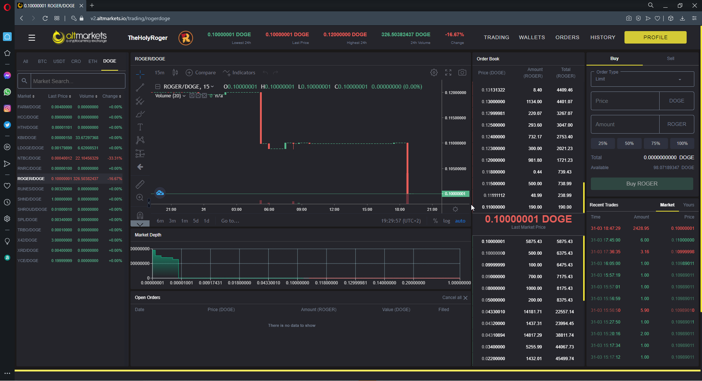
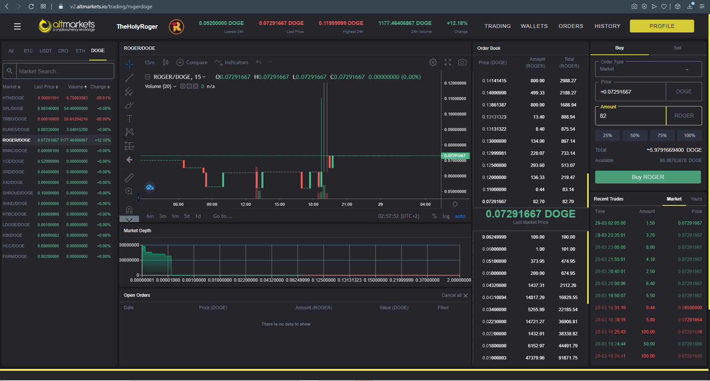

# About ALTMARKETS.IO

In this ABOUT we take ROGER as an example

If we look at it as a game, the objective is to make your coins grows, so you buy low and you sell high

Let's take a look at the trading screen

As you can see there are multiple panels

A "MARKET" order will instantly buy/sell existing sell/buy orders (the red ones) - so it shows you the price it will cost you to do so - it means "I want to buy/sell this amount RIGHT NOW, I don't care what price"

A "LIMIT" order will add a new buy/sell order at the price you choose, and you have to wait for it to be executed by other people that want to trade with you at that price

In the bottom right panel, red orders are sells, green orders are buys

The main value of ROGER is in RED 0.10000001 and it meens that it is gone low otherwise it's green, what does it mean ?

I means that the value of ROGER is fluctuating and has gone low

now let's look at this screen 

It means that if you buy ROGER at this price you buy it low and to make you coins grow you have to wait until the price goes on to a value more then this one
